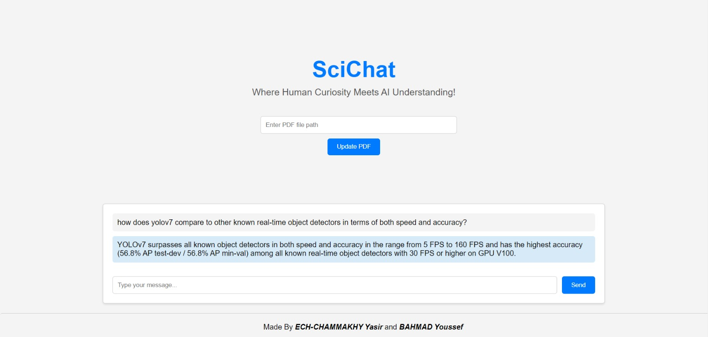

# SciChatBot: AI-powered Analysis and Data Extraction from Scientific Articles

## Project Overview
Welcome to NLP for Scientific Article Analysis in AI: Data Extraction by Chatbot! This project explores the use of natural language processing (NLP) techniques to automatically extract relevant data from scientific articles and present it in a structured format using a chatbot interface. The goal of this project is to enable researchers to quickly and easily access the key findings and insights contained within these articles, saving them time and effort in their work.
The purpose of this project is twofold:
- To develop and train a chatbot that can accurately extract specific types of data from scientific articles, such as authors, titles, abstracts, and keywords.
- To explore the use of NLP techniques for automating the process of extracting relevant information from large volumes of text data, with potential applications in fields such as research analysis, document summarization, and machine learning.

<h2> Installation </h2>
<p><b>1. Clone the Repository </b>: Begin by cloning this repository to your local machine using the following command :</p>

  ```
    git clone https://github.com/yasirech-chammakhy/SciChat-AI-powered-Analysis-and-Data-Extraction-from-Scientific-Articles.git
  ```
<p><b>2. Install the required packages </b>: Install the required packages using the following command :</p>

  ```
    pip install -r requirements.txt
  ```

<p><b>3. Environment Variables: </b>:  Create a '.env' file in the project directory and add the necessary environment variables. This file should include:</p>

  ```
    REPLICATE_API_TOKEN=your_replicate_api_token
    PINECONE_API_KEY=your_pinecone_api_key
  ```

<p><b>4. Run the app </b>: Run the app using the following command :</p>

  ```
    python app.py
  ```

<p><b>5. Open the app </b>: Open the app in your browser using the following URL :</p>

  ```
    http://localhost:8501
  ```

## Demo

